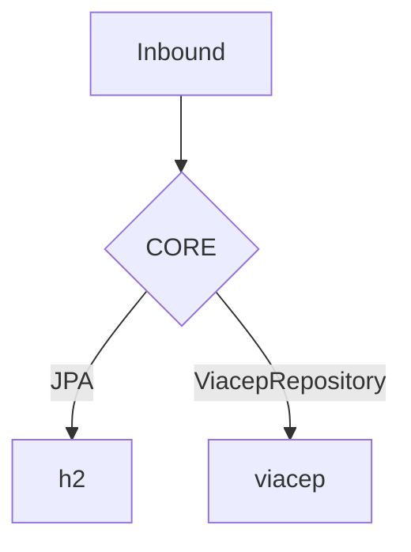
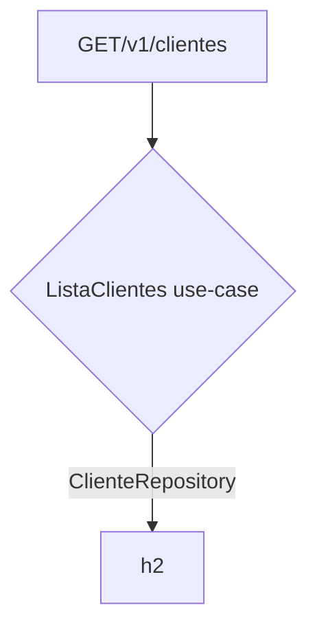

# Etapa Técnica - Muralis
### Problema
Criar um projeto Spring Boot para permitir:
- Cadastrar um cliente
- Consultar um cliente
- Alterar um cliente
- Excluir um cliente
- Listar clientes
- Pesquisar clientes

### Regras
- Ao receber o CEP do cliente, deve-se consultar a API do **viaecep** ou similar, para adquirir os dados do cep e registrar no banco de dados adquiridos atraves da API.

---

### Solução proposta
Para consulta do CEP não atrapalhar o fluxo de cadastro ou atualização do cliente, foi aplicado event sourcing para posterior de criar ou editar o usuário, lançar um evento

```java
class CadastraCliente {
    // ...
    private final ApplicationEventPublisher publisher;
    public CadastraCliente(ApplicationEventPublisher publisher) {
        this.publisher = publisher;
    }
    // ...
    public void execute(Integer id, PersistClienteDto dto) {
        // cadastra cliente e posteriormente lança um evento
        publisher.publishEvent(new ClienteAtualizadoEvent(cliente));
    }
}
```
O qual a classe que consome, pesquisa de fato o CEP e atualiza o usuário de forma assíncrona.
```java
class MapeiaEnderecoPeloCepCliente {
    // ...
    @EventListener // ouvindo o evento
    @Async         // executa em uma thread separada
    public void on(ClienteCadastradoEvent event) {
        this.execute(event.getCliente());
    }
    // ...
}
```

- Foi adicionado resiliência a classe do CEP, para caso a API externa esteja com algum problema, não atrapalhar o fluxo de cadastro ou atualização do cliente. Além de garantir por um maior tempo, a consistência dos dados de endereço.
```java
class ViacepRepositoryImpl implements ViacepRepository {
    @Override
    @Retry(name = "viacep", fallbackMethod = "fallback")
    public Optional<ViacepDto> findByCep(String cep) {
        // busca cep
    }

    // fallback caso a todas as tentativas se esgotem
    public Optional<ViacepDto> fallback(String cep, Exception ignoredEx) {
        // aqui num sistema real, poderia ser notificado tanto a empresa parceira, quanto o cliente
        log.info("Erro ao consultar CEP: {} retornando vazio", cep);
        return Optional.empty();
    }
}
```

### Config de Resiliência
Foi adicionado o retry do resiliencie4j, para caso erro na chamada do viacep, tentar novamente, o mesmo foi adicionado com a seguinte configuração:
- maxAttempts: 5
- waitDuration: 4s
- exponentialBackoffMultiplier: 2

Logo, a cada tentativa de falha, o tempo de espera para a próxima tentativa será o dobro do anterior, e o número máximo de tentativas será de 5.

Como as tentativas são assíncronas, o usuário não será afetado pelo tempo de espera.

### Arquitetura Hexagonal
A arquitetura hexagonal foi aplicada para separar a lógica de negócio da lógica de infraestrutura, permitindo assim, a troca de tecnologias sem afetar a lógica de negócio.


Exemplo de listagem de cliente:

A tecnologia de banco de dados hoje é o h2, mas poderia ser trocada por outro banco de dados, sem afetar a lógica de negócio.

## Como rodar aplicacao
- Para rodar a aplicação, basta executar o comando abaixo:
```bash
./mvnw spring-boot:run
```
- Para rodar os testes, basta executar o comando abaixo:
```bash
./mvnw test
```
- Para obter todas requests no seu Postman, basta importar o arquivo:
[REQUESTS_COLLECTION.json](https://github.com/pablowinck/muralis-desafio-spring-boot/blob/master/REQUESTS_COLLECTION.json)